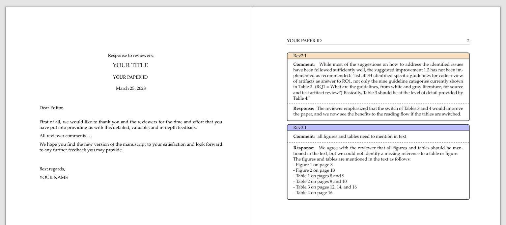

# Rejoinderoo

<p align="center"></p>

Rejoinderoo creates a rejoinder (response to reviewers) based on a CSV or Excel file.
The generated document is a LaTeX or Typst file that can be compiled to PDF.
An example of a generated rejoinder document is shown in [assets/example.pdf](./assets/example.pdf).

<p align="center"></p>

## Development

This project uses a Makefile to manage all build and test tasks.

```sh
# for help and overview of all tasks
make help

# to install all dependencies
make deps

# to build the program
make build

# to run the compiled program
./rejoinderoo
```

## Usage


### Color coding of responses

The response boxes are color-coded based on the ID field,
which is the first selected field.
To determine different reviewers, the prefix of the ID field value is used until the first delimiter (`.`, `-`, or `:`).
E.g., `Rev1.3` becomes `Rev1` and `R1:3` becomes `R1`.

In the next step, a custom LaTeX color is created for each reviewer that can be adjusted.

`\colorlet{colorRev1}{blue!15!white}`

## License

Copyright © 2023-2025 Andreas Bauer

This work (source code) is licensed under [MIT](./LICENSE).
