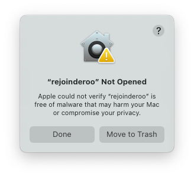
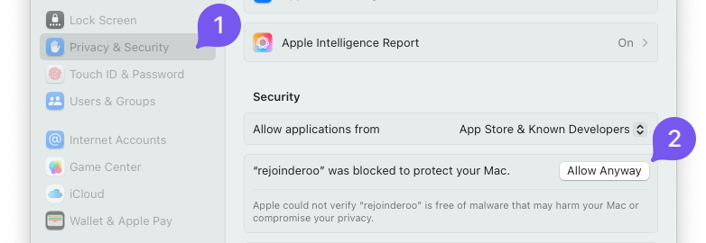

# Rejoinderoo

<p align="center"></p>

Rejoinderoo creates a rejoinder (response to reviewers) based on a CSV or Excel file.
The generated document is a LaTeX or Typst file that can be compiled to PDF.
An example of a generated rejoinder document is shown in [assets/example.pdf](./assets/example.pdf).

<p align="center"></p>

## How to use

### Prepare your review comments

Prepare your CSV or Excel file with the review comments.
The first columns should contain an ID, the reviewer's comment, and the response to that comment.

See [assets/small.xlsx](./assets/small.xlsx) or structure your spreadsheet like this:

| ID     | Comment               | Response                        |
| ------ | --------------------- | ------------------------------- |
| Rev1.1 | This is a comment.    | We appreciate the feedback.     |
| Rev2.2 | Another comment here. | We will take this into account. |

### Run Rejoinderoo

You can use Rejoinderoo in two ways:

As a **command-line tool** after you downloaded the binary from the [releases page](https://github.com/andreas-bauer/rejoinderoo/releases).

```sh
./rejoinderoo
```


Or use the **web** version at [rejoinderoo.andreasbauer.org](https://rejoinderoo.andreasbauer.org).

## Development

This project uses a Makefile to manage all build and test tasks.

```sh
# for help and overview of all tasks
make help

# to install all dependencies
make deps

# to build the program
make build

# to run the compiled program
./rejoinderoo

# to run the web server
./server
```

### Containerized server

You can also build and run the web server in a Docker container.

```sh
# build the Docker image
make build-docker

# run the Docker container
docker compose up
```

### Color coding of responses

The response boxes are color-coded based on the ID field,
which is the first selected field.
To determine different reviewers, the prefix of the ID field value is used until the first delimiter (`.`, `-`, or `:`).
E.g., `Rev1.3` becomes `Rev1` and `R1:3` becomes `R1`.

In the next step, a custom LaTeX (or other template) color is created for each reviewer that can be adjusted.

`\colorlet{colorRev1}{blue!15!white}`

## macOS

If you are using macOS, you will encounter an security warning when running the binary.



To bypass this warning, you can open the Terminal and run the following command:

```sh
xattr -d com.apple.quarantine ./rejoinderoo
```

or you can adjust the security settings in the System Preferences:



## License

Copyright © 2023-2025 Andreas Bauer

This work (source code) is licensed under [MIT](./LICENSE).
