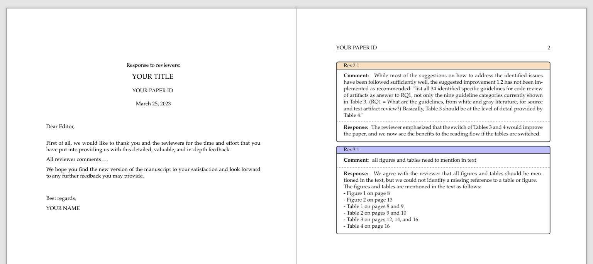

# Rejoinderoo

<p align="center"></p>

Rejoinderoo creates a rejoinder (response to reviewers) LaTeX document based on a CSV file.
An example of a generated rejoinder document is shown in [example.pdf](./example.pdf).

<p align="center"></p>

## Prerequisites

Rejoinderoo depends on [Pick](https://pypi.org/project/pick/) to provide the selection interface for
data fields of the CSV file.
You have to install the dependencies first.

```sh
pip install -r requirements.txt
```

## Usage

Step 1) Prepare the response to reviewers in a spreadsheet and export it as a CSV file,
like the [input.csv](./input.csv).

At least three columns are required to be able to parse the CSV file.
Have a look at  as an example of

Step 2) Run `main.py` with two arguments: the input CSV file and the output file name.

```sh
# show help
python3 main.py -h

# usage
python3 main.py input.csv output.tex
```

Step 3)

Select all fields (columns) from the CSV file
that shall be included in the generated document.

```sh
 $ python3 main.py
 Select at least three fields (ID, reviewer comment, author response)

   (x) ID
   (x) Comment
 * (x) Response
   ( ) Action
   ( ) Where
   ( ) Status
   ( ) Responsible
```

### Color coding of responses

The response boxes are color-coded based on the ID field,
which is the first selected field.
To determine different reviewers, the prefix of the ID field value is used until the first delimiter (`.`, `-`, or `:`).
E.g., `Rev1.3` becomes `Rev1` and `R1:3` becomes `R1`.

In the next step, a custom LaTeX color is created for each reviewer that can be adjusted.

`\colorlet{colorRev1}{blue!15!white}`

## Customization

To customize the generated LaTeX file, you can either adjust [template.tex](./template.tex) or replace it with your own file.
The script will replace the placeholder `%%%%%custom-command%%%%%` and `%%%%%ccomments%%%%%` in the [template.tex](./template.tex) file with the generated content.

## License

Copyright © 2023 Andreas Bauer

This work (source code) is licensed under  [MIT](./LICENSE).
